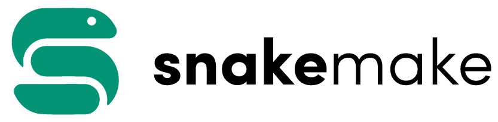
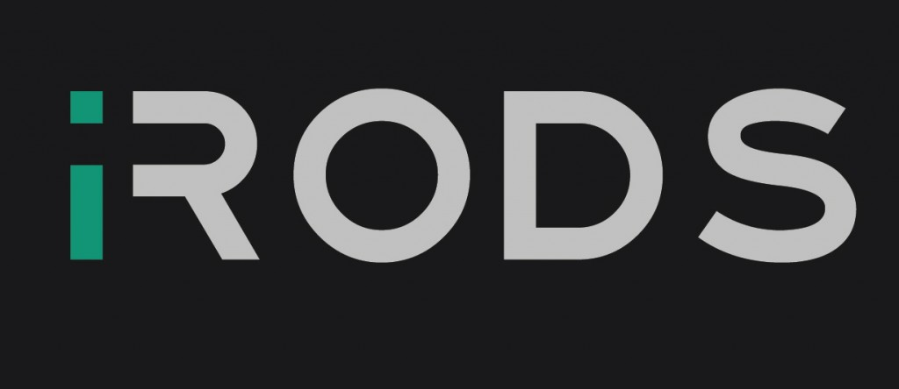

## Hi there 👋

## 🌐 Socials:
### connect with me 

# 💻 Tech Stack:
              

# 📊 GitHub Stats:

---

###

###

<!-- Proudly created with GPRM ( https://gprm.itsvg.in ) -->
<!--
**sigau/sigau** is a ✨ _special_ ✨ repository because its `README.md` (this file) appears on your GitHub profile.

Here are some ideas to get you started:

- 🔭 I’m currently working on ...
- 🌱 I’m currently learning ...
- 👯 I’m looking to collaborate on ...
- 🤔 I’m looking for help with ...
- 💬 Ask me about ...
- 📫 How to reach me: ...
- 😄 Pronouns: ...
- ⚡ Fun fact: ...
-->
